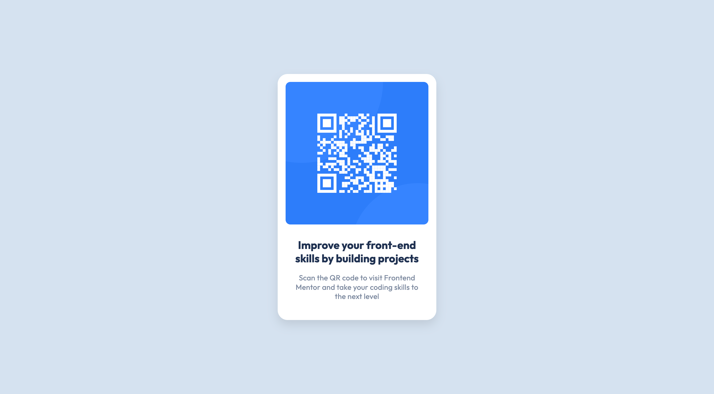

# Frontend Mentor - QR code component solution

This is a solution to the [QR code component challenge on Frontend Mentor](https://www.frontendmentor.io/challenges/qr-code-component-iux_sIO_H). Frontend Mentor challenges help you improve your coding skills by building realistic projects. 

## Table of contents

- [Overview](#overview)
  - [Screenshot](#screenshot)
  - [Links](#links)
- [My process](#my-process)
  - [Built with](#built-with)
  - [What I learned](#what-i-learned)
  - [Continued development](#continued-development)
  - [Useful resources](#useful-resources)
- [Author](#author)

## Overview
The challenge was to build out this QR code component and get it looking as close to the design as possible.

### Screenshot



### Links

- Solution URL: [https://www.frontendmentor.io/solutions/qr-code-component-HkBukQSVc](https://www.frontendmentor.io/solutions/qr-code-component-HkBukQSVc)
- Live Site URL: [https://qrcode-component.chrisnowicki.io/](https://qrcode-component.chrisnowicki.io/)
### Built with

- Semantic HTML5 markup
- CSS custom properties
- Flexbox

### What I learned

I tried to focus on concepts that I've been learning through the **Full-Stack Engineer** Career Path with [codecademy](https://www.codeacademy.com).  Although, one area that I had not learned was *Flexbox Basics*.  I used *Flexbox* to position the QR card horizontally & vertically in the center of the browser window.  

Some key code that helped me was setting the default margin, padding, and box sizing:

```css
* {
    margin: 0px;
    padding: 0px;
    box-sizing: border-box;
}
```
and the container setting for the QR Code:

```css
.card-container {
    max-width: 1440px;
    min-width: 375px;
    height: 100vh;
    display: flex;
    align-items: center;
    justify-content: center;
}
```
Honestly, I'm not sure if `max-width` or `min-width` were needed and learning about `height: 100vh;` and how that relates to 100% of the view port height.

I also focused on importing the font into the *.css* file using the `@font-face` at rule.  Again, probably wasn't needed and could have added the font to the *style* section of *index.html*.

... and of course **GitHub**.  This was the first project where I focused on using the command line for *git* commands, creating branches, merging branches, and deleting local/remote branches.

### Continued development

Next I want to focus on responsive design and practice more with *Flexbox* and *Grid* layout methods.

### Useful resources

- [Flexbox Crash Course 2022](https://youtu.be/3YW65K6LcIA) - This youtube video was the **AH-HA!** moment that helped me understand the Flexbox layout method.

## Author

- Frontend Mentor - [@chris-wix](https://www.frontendmentor.io/profile/chris-wix)
- Twitter - [@iamwix](https://www.twitter.com/iamwix)
